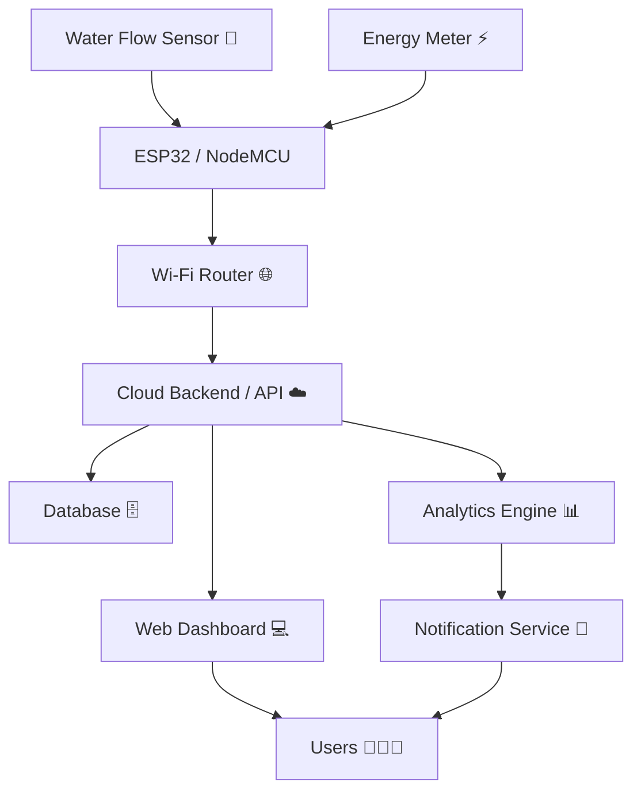

# Aquawatt - Water & Electricity Usage Tracker

<div align="center">
  
         

</div>

---

## 🚀 Introduction  
**Aquawatt** is an **IoT-powered water and electricity monitoring system** designed to help households track and manage **per-room resource consumption**. It tackles challenges like **rising utility bills**, **resource wastage**, and **lack of awareness** about daily usage patterns in different areas of the home (kitchen, bedroom, etc.).  

Using **low-cost IoT sensors** (water flow meters & smart energy monitors), Aquawatt captures real-time data and transmits it via **Wi-Fi** to a **centralized backend platform**. The data is then processed, stored, and displayed through a **full-stack web dashboard**, where users can explore **real-time and historical usage insights** with interactive charts and summaries.  

Aquawatt empowers users with **actionable insights**, enabling them to **detect anomalies**, **optimize daily routines**, and ultimately **reduce utility bills**—inspired by smart home solutions proven to cut electricity usage by up to **15%**.  

---

## ✨ Features  

| Feature | Description |
|---------|-------------|
| 🚰 **Water Usage Monitoring** | Tracks real-time water consumption in each room using flow sensors. |
| ⚡ **Electricity Usage Monitoring** | Measures energy usage with CT sensors for per-room insights. |
| 📡 **IoT Connectivity** | ESP32/NodeMCU sends data securely via Wi-Fi using MQTT/HTTP. |
| ☁️ **Cloud Storage & Processing** | Stores usage data in a time-series database for analysis. |
| 📊 **Analytics & Visualization** | Provides detailed charts, comparisons, and anomaly detection. |
| 🔔 **Smart Alerts** | Sends notifications for overuse, leaks, or abnormal power consumption. |
| 🌍 **Scalability** | Supports multi-room, multi-building, and future smart home integration. |
| 💻 **User Dashboard** | Web-based interface (React + Tailwind) for real-time monitoring. |

---

## 🛠️ Tech Stack

**Frontend:**  


**Backend:**  


**Hardware Components**  
            


---

## 🔧 Aquawatt — Block Diagram



---

## 📸 Screenshots  

<p align="center">
  <!-- Replace these image paths with your actual project screenshots -->
  
  
</p>

<p align="center">
  <!-- Replace these image paths with your actual project screenshots -->
  
  
</p>

---

## 📂 Resources  

<p align="center">
  <!-- Project PPT -->
  <a href="Abstract/AQUAWATT_PROJECT.pdf" target="blank">
    
  </a>

  <!-- Project Video -->
  <a href="Prototype video/Aquawatt video (1).mp4" target="blank">
    
  </a>
</p>

---

# File Tree: Aquawatt : A water and electricity tracking application

```
├── 📁 waterlight-harmony-07-main/
│   ├── 📁 node_modules/ 🚫 (auto-hidden)
│   ├── 📁 public/
│   │   ├── 🖼️ favicon.ico
│   │   ├── 🖼️ og-image.png
│   │   └── 🖼️ placeholder.svg
│   ├── 📁 src/
│   │   ├── 📁 components/
│   │   │   ├── 📁 home/
│   │   │   │   ├── 📄 AchievementsSection.tsx
│   │   │   │   ├── 📄 AdvancedChatbot.tsx
│   │   │   │   ├── 📄 ChatbotWidget.tsx
│   │   │   │   ├── 📄 FactsSection.tsx
│   │   │   │   ├── 📄 FeaturesSection.tsx
│   │   │   │   ├── 📄 HeroSection.tsx
│   │   │   │   ├── 📄 NotesSection.tsx
│   │   │   │   └── 📄 ToolsSection.tsx
│   │   │   ├── 📁 ui/
│   │   │   │   ├── 📄 accordion.tsx
│   │   │   │   ├── 📄 alert-dialog.tsx
│   │   │   │   ├── 📄 alert.tsx
│   │   │   │   ├── 📄 aspect-ratio.tsx
│   │   │   │   ├── 📄 avatar.tsx
│   │   │   │   ├── 📄 badge.tsx
│   │   │   │   ├── 📄 breadcrumb.tsx
│   │   │   │   ├── 📄 button.tsx
│   │   │   │   ├── 📄 calendar.tsx
│   │   │   │   ├── 📄 card.tsx
│   │   │   │   ├── 📄 carousel.tsx
│   │   │   │   ├── 📄 chart.tsx
│   │   │   │   ├── 📄 checkbox.tsx
│   │   │   │   ├── 📄 collapsible.tsx
│   │   │   │   ├── 📄 command.tsx
│   │   │   │   ├── 📄 context-menu.tsx
│   │   │   │   ├── 📄 dialog.tsx
│   │   │   │   ├── 📄 drawer.tsx
│   │   │   │   ├── 📄 dropdown-menu.tsx
│   │   │   │   ├── 📄 form.tsx
│   │   │   │   ├── 📄 header.tsx
│   │   │   │   ├── 📄 hover-card.tsx
│   │   │   │   ├── 📄 input-otp.tsx
│   │   │   │   ├── 📄 input.tsx
│   │   │   │   ├── 📄 label.tsx
│   │   │   │   ├── 📄 menubar.tsx
│   │   │   │   ├── 📄 navigation-menu.tsx
│   │   │   │   ├── 📄 pagination.tsx
│   │   │   │   ├── 📄 popover.tsx
│   │   │   │   ├── 📄 progress.tsx
│   │   │   │   ├── 📄 radio-group.tsx
│   │   │   │   ├── 📄 resizable.tsx
│   │   │   │   ├── 📄 scroll-area.tsx
│   │   │   │   ├── 📄 select.tsx
│   │   │   │   ├── 📄 separator.tsx
│   │   │   │   ├── 📄 sheet.tsx
│   │   │   │   ├── 📄 sidebar.tsx
│   │   │   │   ├── 📄 skeleton.tsx
│   │   │   │   ├── 📄 slider.tsx
│   │   │   │   ├── 📄 sonner.tsx
│   │   │   │   ├── 📄 switch.tsx
│   │   │   │   ├── 📄 table.tsx
│   │   │   │   ├── 📄 tabs.tsx
│   │   │   │   ├── 📄 textarea.tsx
│   │   │   │   ├── 📄 toast.tsx
│   │   │   │   ├── 📄 toaster.tsx
│   │   │   │   ├── 📄 toggle-group.tsx
│   │   │   │   ├── 📄 toggle.tsx
│   │   │   │   ├── 📄 tooltip.tsx
│   │   │   │   └── 📄 use-toast.ts
│   │   │   ├── 📄 AnalyticsMap.tsx
│   │   │   ├── 📄 AnalyticsSearch.tsx
│   │   │   ├── 📄 AuthButton.tsx
│   │   │   ├── 📄 DashboardHeader.tsx
│   │   │   ├── 📄 HomeCalculator.tsx
│   │   │   ├── 📄 HomeCalendar.tsx
│   │   │   ├── 📄 NotesFeature.tsx
│   │   │   ├── 📄 RandomFact.tsx
│   │   │   ├── 📄 Sidebar.tsx
│   │   │   ├── 📄 ThemeToggle.tsx
│   │   │   ├── 📄 UsageCard.tsx
│   │   │   └── 📄 UserAchievements.tsx
│   │   ├── 📁 contexts/
│   │   │   └── 📄 LanguageContext.tsx
│   │   ├── 📁 hooks/
│   │   │   ├── 📄 use-mobile.tsx
│   │   │   └── 📄 use-toast.ts
│   │   ├── 📁 integrations/
│   │   │   └── 📁 supabase/
│   │   │       ├── 📄 client.ts
│   │   │       └── 📄 types.ts
│   │   ├── 📁 lib/
│   │   │   └── 📄 utils.ts
│   │   ├── 📁 pages/
│   │   │   ├── 📄 About.tsx
│   │   │   ├── 📄 Analytics.tsx
│   │   │   ├── 📄 Billing.tsx
│   │   │   ├── 📄 Dashboard.tsx
│   │   │   ├── 📄 Devices.tsx
│   │   │   ├── 📄 Index.tsx
│   │   │   ├── 📄 NotFound.tsx
│   │   │   └── 📄 Profile.tsx
│   │   ├── 🎨 App.css
│   │   ├── 📄 App.tsx
│   │   ├── 🎨 index.css
│   │   ├── 📄 main.tsx
│   │   └── 📄 vite-env.d.ts
│   ├── 📁 supabase/
│   │   └── ⚙️ config.toml
│   ├── 🚫 .gitignore
│   ├── 📖 README.md
│   ├── 📄 bun.lockb
│   ├── 📄 components.json
│   ├── 📄 eslint.config.js
│   ├── 🌐 index.html
│   ├── 📄 package-lock.json
│   ├── 📄 package.json
│   ├── 📄 postcss.config.js
│   ├── 📄 tailwind.config.ts
│   ├── 📄 tsconfig.app.json
│   ├── 📄 tsconfig.json
│   ├── 📄 tsconfig.node.json
│   └── 📄 vite.config.ts
└── 📄 package-lock.json
```

---

## Contributing 🤝

Contributions are welcome! If you’d like to improve this project or add features, feel free to:

1. Fork the repo.
2. Create a new branch.
3. Submit a pull request.

I appreciate all suggestions for enhancement! 🙏

---

## Contact Me 📬

Let’s connect:

[](mailto:m.dinesh.it27@gmail.com)
[](https://www.linkedin.com/in/m-dinesh-d30/)
[](https://www.instagram.com/_dinx_pvt_430)
[](https://github.com/dineshit27)

Thanks for stopping by! 👋

---

### Made with ❤️ by **Dinesh M**
